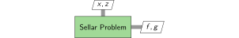
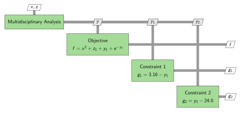

# Getting Started: The Sellar Problem

The Sellar problem is is a two-discipline toy problem introduced by R.S. Sellar, S.M. Batill, and J.E. Renaud in "Response Surface Based, Concurrent Subspace Optimization for Multidisciplinary System Design".  The problem itself is non-physical, but it provides a simple example with which to demonstrate multidisciplinary coupling and analysis capabilities.

Each of the two disciplines in the Sellar problem consists of a single explicit equation.  The output of each discipline is used as an input to the other discipline.  Together, the two disciplines form a nonlinear system of equations which must be solved in order to obtain valid outputs.  The outputs of the coupled system of equations are used to construct objective and constraint functions for an optimization. The following is an XDSM diagram of the problem structure.


Our goal is to manipulate this problem in order to create a single explicit function/component which defines the objective and constraint values as well as their derivatives with respect to the design variables (the inputs).  In other words, we would like to take the diagram shown above and convert it to the following one-component system, and propagate derivatives while doing so.



## Defining System Variables

Let's start by loading the package and defining the system variables.  This can be done with the ``@var`` macro.

```@example guide
using CoupledSystems

# Name all variables and give them default values
@var x = 0.0
@var y1 = 0.0
@var y2 = 0.0
@var z1 = 0.0
@var z2 = 0.0
@var f = 0.0
@var g1 = 0.0
@var g2 = 0.0
nothing #hide
```

Each variable's name is used to define connections between components. The value assigned to each variable is generally used just to define the size and type of each variable, but it may also be used to generate an initial guess for a nonlinear solver.

## Constructing Explicit Components

Now that we have defined our system variables, we can use them to construct each of the components in the Sellar problem.  Since all of the components (when considered in isolation) are explicit, we model them as such.  

```@example guide
# --- Define Discipline 1 --- #

# describe function inputs/outputs
fin = (x, y2, z1, z2) # inputs
fout = (y1,) # normal outputs
fout_m = () # in-place (mutating) outputs

# create function for discipline 1
function f_d1(x, y2, z1, z2)
    y1 = z1^2 + z2 + x - 0.2*y2
    return y1
end

# construct explicit component for discipline 1
d1 = ExplicitComponent(f_d1, fin, fout, fout_m; deriv=ForwardFD())

# --- Define Discipline 2 --- #

# describe function inputs/outputs
fin = (y1, z1, z2) # inputs
fout = (y2,) # normal outputs
fout_m = () # in-place (mutating) outputs

# create function for discipline 2
function f_d2(y1, z1, z2)
    y2 = sqrt(y1) + z1 + z2
    return y2
end

# construct explicit component for discipline 2
d2 = ExplicitComponent(f_d2, fin, fout, fout_m; deriv=ForwardFD())

# --- Define Objective --- #

# describe function inputs/outputs
fin = (x, y1, y2, z1) # inputs
fout = (f,) # normal outputs
fout_m = () # in-place (mutating) outputs

# create objective function
function f_obj(x, y1, y2, z1)
    f = x^2 + z1 + y1 + exp(-y2) # objective
    return f
end

# construct explicit component for objective
obj = ExplicitComponent(f_obj, fin, fout, fout_m; deriv=ForwardFD())

# --- Define Constraint 1 --- #

# describe function inputs/outputs
fin = (y1,) # inputs
fout = (g1,) # normal outputs
fout_m = () # in-place (mutating) outputs

# define first constraint function
function f_c1(y1)
    g1 = 3.16 - y1
    return g1
end

# construct explicit component for constraint 1
c1 = ExplicitComponent(f_c1, fin, fout, fout_m; deriv=ForwardFD())

# --- Define Constraint 2 --- #

# describe function inputs/outputs
fin = (y2,) # inputs
fout = (g2,) # normal outputs
fout_m = () # in-place (mutating) outputs

# define second constraint function
function f_c2(y2)
    g2 = y2 - 24.0
    return g2
end

# construct explicit component for constraint 2
c2 = ExplicitComponent(f_c2, fin, fout, fout_m; deriv=ForwardFD())

nothing #hide
```

The method by which to calculate the jacobian of each component is provided through the `deriv` keyword argument.  Possible jacobian calculation methods include:
 - Forward Finite Differencing ([`ForwardFD`](@ref)) (default)
 - Central Finite Differencing ([`CentralFD()`](@ref))
 - Complex Step Finite Differencing ([`ComplexFD()`](@ref))
 - Forward-Mode Automatic Differentiation ([`ForwardAD()`](@ref))
 - Reverse-Mode Automatic Differentiation ([`ReverseAD()`](@ref))  
You can even provide your own jacobian function through the `df` keyword argument.

## Converting Explicit Components into Implicit Components

We would like to be able to converge all interdependent components simultaneously.  This can be done with the help of a nonlinear solver.  Let's go ahead and add one to the XDSM diagram.


Notice that the two disciplinary components have been converted to implicit components so that they can provide residual vectors to the nonlinear solver.  The nonlinear solver then drives these residuals to zero and provides the final states/outputs `y_1` and `y_2` to the rest of the system.  Let's go ahead and convert our explicit components to implicit components so that they can be used to provide residual vectors (and associated derivatives) to the nonlinear solver.

```@example guide
# convert discipline 1 into an implicit component
d1i = ImplicitComponent(d1)

# convert discipline 2 into an implicit component
d2i = ImplicitComponent(d2)

nothing #hide
```

## Constructing an Implicit System

At this point we combine the two implicit components to create a single set of residual equations.  The state variables of the corresponding system correspond to the outputs of all of its subcomponents.

```@example guide

# components in the implicit system
components_isys = (d1i, d2i)

# inputs to the implicit system
inputs_isys = (x, z1, z2)

# outputs are the subcomponent outputs

# implicit system construction
isys = ImplicitSystem(components_isys, inputs_isys)

nothing #hide
```

It is also possible to construct an implicit system directly from explicit components.  In this case, explicit components are converted to implicit components during construction.

```@example guide

# components in the implicit system
components_isys = (d1, d2)

# inputs to the implicit system
inputs_isys = (x, z1, z2)

# implicit system construction
isys = ImplicitSystem(components_isys, inputs_isys)

nothing #hide
```

Let's now update the XDSM diagram to account for the newly constructed implicit system.


## Coupling an Implicit Component with a Solver to Construct an Explicit Component

Now that we have a single implicit system of equations, let's couple it with a nonlinear solver in order to solve for the outputs.  We represent the resulting component as an explicit component.  Note that the initial guess for the Newton solver corresponds to the default values of the variables `y1` and `y2`.

```@example guide
mda = ExplicitComponent(isys; solver=Newton())
nothing #hide
```

The default outputs for an implicit component/system which is converted to a explicit component are the state variables of the system.  However, it is also possible to provide only a subset of the state variables as outputs.  This has the potential to reduce computational expenses related to derivative computations.

```@example guide
fout = (y1, y2)
mda = ExplicitComponent(isys, fout; solver=Newton())
nothing #hide
```

Another option for reducing the computational expenses involved with derivative computations is to include an output function (expressed as an explicit component) when coupling an implicit system with a nonlinear solver.  An output function calculates a small number of outputs (relative to the number of state variables) from the inputs and state variables of an implicit system.

Since all state variables are outputs in this toy problem, there is no benefit to adopting this approach here, but in many practical applications the number of outputs is far less than the number of states, making the use of an output function highly beneficial.

```@example guide

# Create an output component (trivial for this problem)
fin = (y1, y2)
fout = (y1, y2)
foutin = ()
fcomp = (y1, y2) -> (y1, y2)
comp = ExplicitComponent(fcomp, fin, fout, foutin; deriv = ForwardFD())

mda = ExplicitComponent(isys, comp; solver=Newton())
nothing #hide
```

Here is the XDSM diagram of the Sellar problem after combining the implicit system of equations with the nonlinear solver to create an explicit component.



## Combining Explicit Components into an Explicit System

Since there are no longer any model interdependencies, each component may be called sequentially to generate the final output.  We can express this sequence of explicit components as a single explicit system with its own set of inputs and outputs

```@example guide

# components in the sellar problem
components_sellar = (mda, obj, c1, c2)

# inputs to the sellar problem
inputs_sellar = (x, z1, z2)

# outputs from the sellar problem
outputs_sellar = (f, g1, g2)

sellar = ExplicitSystem(components_sellar, inputs_sellar, outputs_sellar)

nothing #hide
```

At this point we have achieved our goal of representing the Sellar problem as an explicit one-component system.


## Querying Explicit Components and/or Systems

Now that our entire system has been reduced down into a single explicit component, we can easily obtain the outputs (expressed as a vector) and their derivatives (expressed as a matrix) with respect to the design variables for any set of design variables.

```@example guide
# input arguments to the Sellar problem, expressed as a single vector
X = [0.29, 0.78, 0.60]

# outputs from the Sellar problem, expressed as a single vector
Y = outputs!(sellar, X)

# jacobian of the outputs with respect to the inputs, expressed as a matrix
dYdX = jacobian!(sellar, X)

# combined evaluation of outputs and jacobian
Y, dYdX = outputs_and_jacobian!(sellar, X)

nothing #hide
```

If the vectorized input/output format is inconvenient, CoupledSystems provides utility functions which may be used to combine inputs and/or separate outputs.

```@example guide
# define inputs as variables
x_test = 0.29
z1_test = 0.78
z2_test = 0.60

# sellar problem vector input
X = combine((x_test, z1_test, z2_test))

# sellar problem vector and jacobian output
Y, dYdX = outputs_and_jacobian!(sellar, X)

# sellar problem variable outputs (in order)
f, g1, g2 = separate(outputs_sellar, Y)
```

## Verifying Derivatives

Derivatives can be verified easily using finite differencing.

```@example guide
using FiniteDiff

# Verify using forward finite differencing
f = (X) -> outputs(sellar, X)
dYdX_fd = FiniteDiff.finite_difference_jacobian(f, X)
println("Maximum Error: ", maximum(abs.(dYdX - dYdX_fd)))
nothing #hide
```

For an even better derivative check, the jacobians can be verified against exact derivatives computed using forward mode automatic differentiation.  Note that for this use case, the [NaN-safe mode of ForwardDiff](https://juliadiff.org/ForwardDiff.jl/stable/user/advanced/#Fixing-NaN/Inf-Issues) must be used.

```julia
using ForwardDiff

# Verify using forward mode automatic differentiation
dYdX_ad = ForwardDiff.jacobian(f, X)
error = dYdX - dYdX_ad
println("Maximum Error: ", maximum(abs.(dYdX - dYdX_ad)))
nothing #hide
```

```@example guide
dYdX_ad = [1.4486568466809213 2.0897560103596686 0.6033081762203991; -0.9099208777535168 -1.2374923948590968 -0.7279367033191703; 0.4503956112356196 1.6125380257032502 1.3603164834112624] #hide
error = dYdX - dYdX_ad #hide
println("Maximum Error: ", maximum(abs.(dYdX - dYdX_ad))) #hide
nothing #hide
```

Since this package uses analytic expressions to propagate derivatives, the derivatives computed by this package combined with finite differencing are actually more accurate than those computed using finite differencing alone.

```@example guide
error = dYdX - dYdX_ad
error_fd = dYdX_fd - dYdX_ad
println("Maximum Error using Finite Differencing: ",
    maximum(abs.(dYdX_fd - dYdX_ad)))
println("Maximum Error using Finite Differencing and CoupledSystems: ",
    maximum(abs.(dYdX - dYdX_ad)))
nothing #hide
```

## Final Notes

While the intended use of CoupledSystems is typically to reduce an arbitrarily complex system down to a single explicit component, there are multiple ways in which this may be accomplished.  For example, an alternative approach to modeling the Sellar problem would be to construct a single implicit system from all components and then couple that system with a nonlinear solver.  

Additionally, there are multiple ways in which any given problem may be divided up into components.  For example, we could have defined the objective and constraint functions as a single vector-valued function rather than three.  Ultimately, while these choices may seem arbitrary, different combinations of choices may be more computationally efficient than others, especially for derivative computations.
